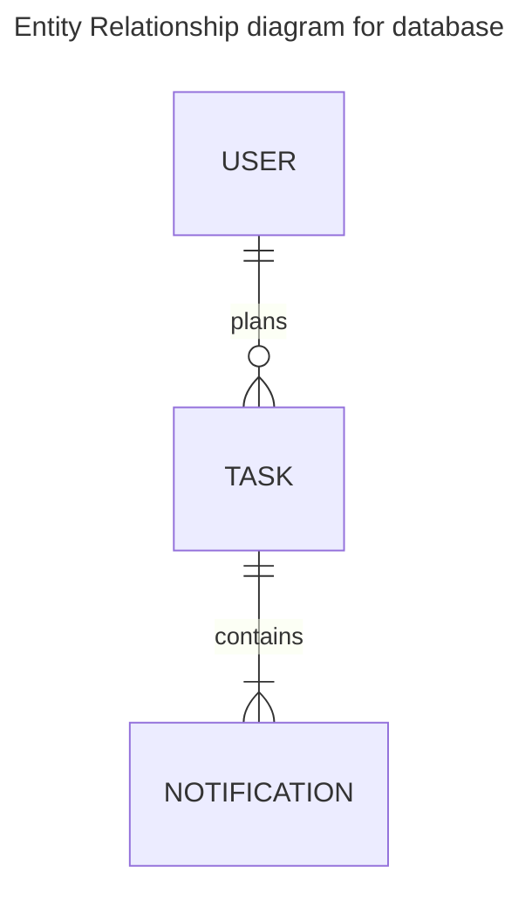

# Task-scheduler-django
Version of my Task Scheduler project made in Django

Features:
- User Registration and Authentication: Secure user authentication and registration system.
- Task Creation: Users can create tasks with attributes such as title, description, priority, and due date.
- Task Scheduling: Set specific dates and times for tasks.
- Email Notifications: Send scheduled email notifications to users reminding them of upcoming tasks.
- Task Management Dashboard: View and manage all created tasks in a user-friendly interface.

# To-Do List (Steps to Complete the Project)
1.  Basic Setup:

 - [x] Create a new Django project (task_scheduler).
 - [x] Set up a virtual environment and install Django and dependencies.
 - [x] Configure database (PostgreSQL).
2. User Authentication:

 - [ ] Implement user registration and login functionality.
 - [ ] Set up Django’s authentication system (using User model).
 - [ ] Add Oauth2.
3. Task Model & Views:

 - [ ] Define Task model with fields like title, description, due date, and priority.
 - [ ] Implement views to create, edit, and delete tasks.
 - [ ] Design task management dashboard.
4.  Email Notifications:
 - [ ] Set up email backend for sending notifications.
 - [ ] Define Celery tasks for scheduling emails.
 - [ ] Use Redis for background task management.
5.  Task Scheduling:
 - [ ] Create task scheduler in Celery to send reminders before the due date.
6.  Testing:
 - [ ] Write unit tests for task creation, task notifications, and email scheduling.
7.  Frontend Enhancements:
 - [ ] Style the dashboard using CSS/Bootstrap.
 - [ ] Implement AJAX or other front-end features for a smoother experience.
8.  Deployment:
 - [x] Dockerize the application.
 - [ ] Prepare the application for deployment (Gunicorn, Nginx, etc.).
 - [ ] Deploy the project on a production server (e.g., Heroku, DigitalOcean).

